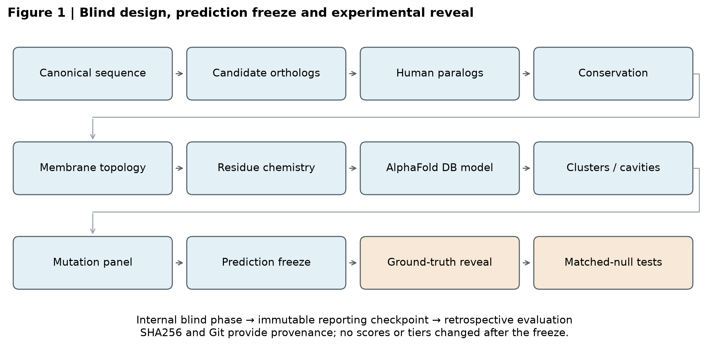
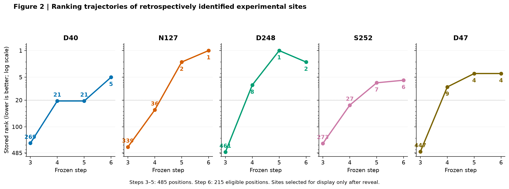

# SLC30A10 · AI for Science case study

**从 485 个氨基酸到可检验的突变假说：一次 AI 辅助、可追溯的计算生物学实践。**

AI-assisted functional-residue prioritization with frozen predictions and retrospective experimental benchmarking.

> 项目技术报告，尚未经过同行评审；没有新增湿实验。它是研究案例，不是已验证的通用靶点发现工具。

## 下载 / Downloads

| 材料 | 入口 |
|---|---|
| 25 页完整 PDF 技术报告 | [下载 PDF](SLC30A10_technical_report.pdf) |
| 代码、输入数据、结果、图表、提示词与复现文档 | [下载完整 ZIP](SLC30A10_reproducibility_package.zip) |
| 数据来源与引用 | [SOURCES.md](SOURCES.md) |
| 发布副本与原始冻结版本的区别 | [PUBLICATION_NOTES.md](PUBLICATION_NOTES.md) |
| 下载完整性校验 | [SHA256SUMS.txt](SHA256SUMS.txt) |

如果 GitHub 显示文件预览，使用页面的 Download raw file 按钮保存。ZIP 解压后，先阅读 README.md 和 PUBLICATION_NOTES.md；运行 `python3 verify_public.py` 检查发布包完整性。包内 scripts/ 和 comparison/ 包含分析代码，data/、sequences/、structures/ 包含输入，results/ 包含计算结果。第三方论文全文等材料不在包内，见来源说明。

## 研究问题

能否在不使用目标论文实验位点的预测阶段，结合进化信息、跨膜拓扑、残基化学与预测结构，优先选出值得实验检验的 SLC30A10 残基？

## 主要结果与边界

- 四个实验 Mn²⁺ 配位位点 D40、N127、D248、S252，在冻结 Step 6 中分别位于第 5、1、2、6 名。
- 五个 transport-essential 位点全部进入 Top 10。
- Matched-null 评估每个 benchmark/null 使用 1,000,000 次接受的随机抽样；控制部分生物学先验后仍保留部分统计信号。
- 最严格 NULL 5 没有校正后显著性，A/B 只有九种可能匹配集合，结构几何的独立增益仍不确定。

预测结果在实验比较前冻结；但该案例是 retrospective target selection 下的 prospective-style 工作流，不应被称为完全独立的前瞻性实验。AlphaFold 的训练/模板影响及实验结构以 AlphaFold2 初始化等因素限制独立性。未测试位点不等于假阳性。

## AI 与人的角色

工作流由人提出研究问题并指导，AI coding agent 辅助代码实现、远程计算、检查及文档整理。这里没有训练新的基础模型，也没有证明模型自主发现了新的结合位点。规则、代码、数据与局限一并提供，供审查与讨论。

## Reproducibility

Local orchestration → remote CPU computation → checksum verification → blind freeze → ground-truth comparison → matched-null evaluation → technical report.

The downloadable archive includes the original stage methods, analysis scripts, frozen numerical outputs, standardized prompt templates and parameter specification. It is an archival case study, not a one-command portable application. Paths were normalized in a separate publication copy. Historical manifests are retained as evidence; use the new public manifest to verify this distribution. Missing third-party assets must be obtained from their sources before reproducing affected stages.

Scientific report source commit: `03379f6af433d0134a8d910a39cd8993fc0ea9a3`  
Blind checkpoint: `008b7ad7a436fc02898292ec7d0441cf0df6c390`

## 引用与使用

请区分本项目的计算结果与原研究的实验数据。原研究及数据库来源见 [SOURCES.md](SOURCES.md)。目前未选择新的代码/报告复用许可证；公开下载不代表所有材料拥有同一种开源许可。

欢迎通过 Issues 讨论方法、复现问题和进一步的外部验证。
